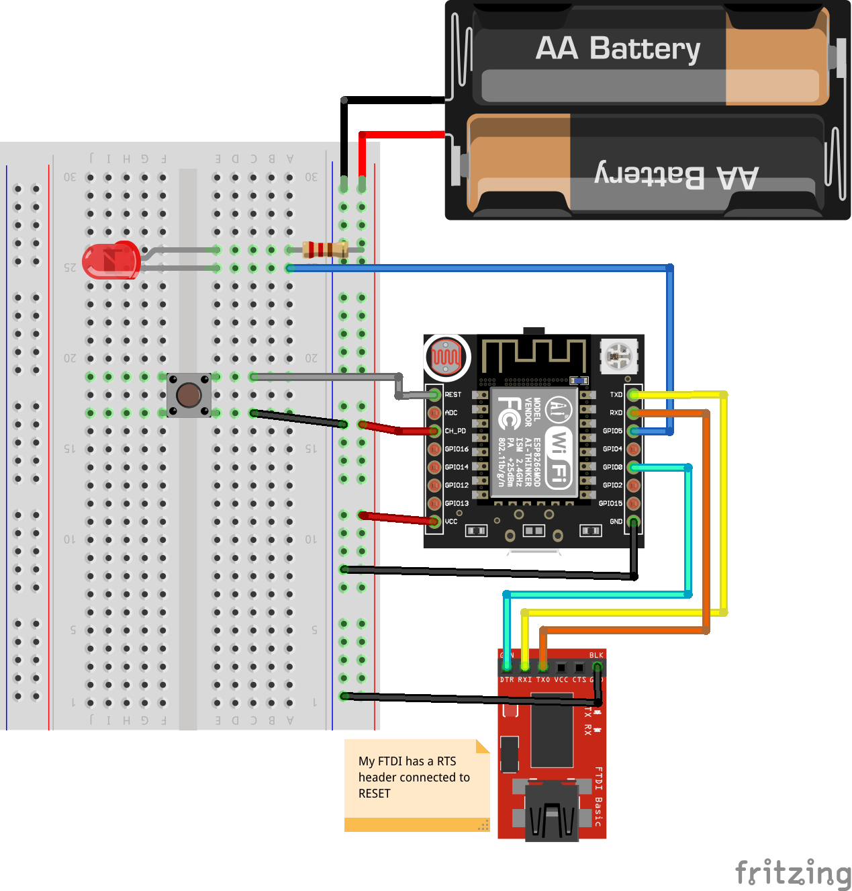

# Ma, I’m home

That project is a connected button which, when pressed, send a SMS to people. It’s used by my son, to text me when he’s back from school.
You can [see it in action on youtube](https://www.youtube.com/watch?v=YSLezdGY_Ck).

## Instructions

### ESP8266 Connections

I’m using a ESP8266 ESP-12 with an adapter plate including resistors, not included in my schematic.

- VCC to 3.3
- Ground to ground
- CH_PD from ESP to VCC
- LED + connected to a 220 ohm resistor and to VCC
- LED - connected to GPIO5
- Button connected to ground and RESET on ESP
- RX from FTDI to TX on ESP
- TX from FTDI to RX on ESP
- DTR from FTDI to GPIO 0 on ESP
- RST from FTDI to RESET on ESP

## Software

copy `parameters.h.dist` to `parameters.h` and replace wifi SSID and password. You can use SMS free mobile API but it can only send SMS to your mobile phone, not any random number. You would have to change host and URL if you’re using another celullar provider.
Beware, you need to extract SHA1 TLS certificate finterprint and update it in order to make the TLS connection work.

In arduino IDE, set `Node MCU 1.0 (ESP-12E module)` before compiling.

## links

  * [ESP8266 official doc](https://github.com/espressif/esptool/wiki/ESP8266-Boot-Mode-Selection)
  * [A Beginner's Guide to the ESP8266](https://tttapa.github.io/ESP8266/Chap01%20-%20ESP8266.html)
  * [ESP8266 NodeMCU HTTPS Secured POST Request](https://circuits4you.com/2019/02/08/esp8266-nodemcu-https-secured-post-request/)
  * [ESP8266 Wi-Fi Button – DIY Amazon Dash Button Clone](https://randomnerdtutorials.com/esp8266-wi-fi-button-diy-amazon-dash-button-clone/)
  * [ESP8266 Pinout Reference](https://randomnerdtutorials.com/esp8266-pinout-reference-gpios/)
  * [Free Mobile SMS API](https://www.freenews.fr/freenews-edition-nationale-299/free-mobile-170/nouvelle-option-notifications-par-sms-chez-free-mobile-14817)
